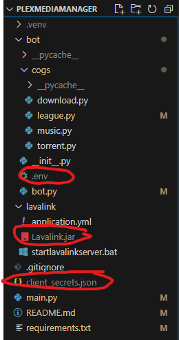

# Plex Media Manager
## A python bot which converts YouTube videos to MP3s and sends the raw MP3 file to the user. Can also play music through Discord. 

## Usage
- ^!download {url} {channel} - Downloads the song to the requested channel. If the channel does not exist, it will create a new channel of the requested name. If the song already exists, an error will pop up saying that the song has already been downloaded with a link to the song.
- ^!playlist {url} {channel} [starting index] [ending index] - Downloads the playlist to the requested channel. If the channel does not exist, it will create a new channel of the requested name. Starting index indicates where to start downloading the playlist from (inclusive). Ending index indicates where to stop downloading the playlist from (exclusive).
- ^!list {channel} - Lists all songs downloaded in the discord channel.
- ^!play c {channel} [starting index] [ending index] - Plays songs from discord channel.
- ^!play {youtube url} - Plays song from youtube.
- ^!playlist {youtube url} - Plays playlist from youtube.

## Coming Soon
- Webscraping torrent websites
- Downloading torrents to qbittorrent with magnet links
- Moving torrented files to plex folders on completion and random media checks

## Requirements
- Java 17 
- Python 3.11
- Lavalink 3.7.8
- Pip + Every package in requirements.txt
- Riot API Key in .env file at root of project
- Google API Key & client_secrets.json at root of project
- Discord Bot Token in .env file at root of project

## How to operate bot (I always forget how to)
1. Run lavalink server via Java or Run startlavalinkserver.bat
3. Invite the bot to your server.
2. Run main.py.
4. Run commands.

## Current Modules
### League of Legends Rank Tracker
### Youtube to MP3 & Youtube Downloader
### Discord Music Bot
### Torrent Webscraper

## Limitations/Buglist
- Playing a playlist only does up to 320 the first songs when playing.
- The code for voice chats and parsing voice chats through commands is a lil buggy, needs to be fixed.
- League leaderboard doesnt 